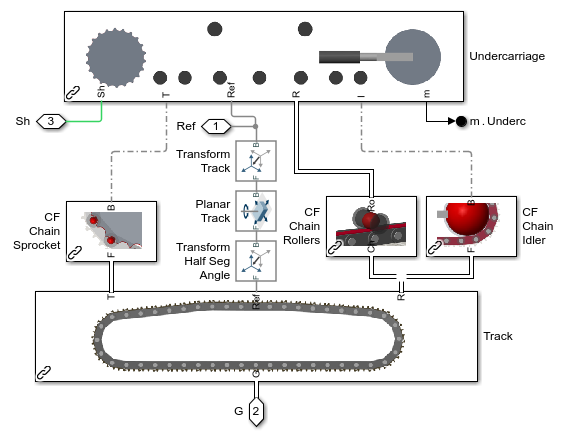
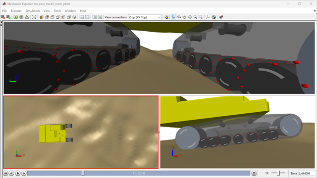
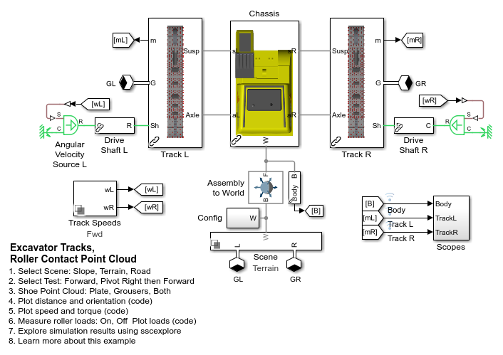
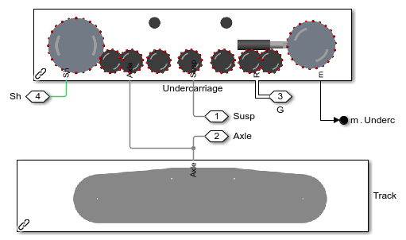

# **Tracked Vehicle Model with Simscape&trade;**
Copyright 2023 The MathWorks, Inc.

This repository contains models and code to help engineers model and simulate 
tracked vehicles. A set of examples shows how to assemble track segments 
into a chain that will mesh with the sprocket, rollers, and idler 
in the vehicle undercarriage. Models of vehicles traveling on multiple wheels 
are also provided.

* **Fully parameterized models** of tracked and multi-axle vehicles
* **Detailed and abstract variants** for testing different systems
* **Modular library elements** enable assembly of parameterized tracks. 
* **Customizable contact force definition** enable tracked vehicle models tailored to simulation task.
* **MATLAB enables automation** of modeling, simulation, and post-processing tasks.

Open the project file Tracked_Vehicle_Simscape.prj to get started.

## **Tracked Vehicle Animation Clip**

## **Tracked Vehicle at Varying Fidelity Levels**
Use the model that best suits your needs.  This repository contains abstract, 
fast running models and detailed models that model each segment individually.

## **Model of Segmented Track on Uneven Terrain**

## **Track and Undercarriage**

## **Track Assembly**

## **Model of Tracked Vehicle Modeled using Rollers on Uneven Terrain**

## **Track and Undercarriage**

To learn more about modeling and simulation with Simscape, please visit:
* [Simscape Getting Started Resources](https://www.mathworks.com/solutions/physical-modeling/resources.html)
* Product Capabilities:
   * [Simscape&trade;](https://www.mathworks.com/products/simscape.html)
   * [Simscape Battery&trade;](https://www.mathworks.com/products/simscape-battery.html)
   * [Simscape Driveline&trade;](https://www.mathworks.com/products/simscape-driveline.html)
   * [Simscape Electrical&trade;](https://www.mathworks.com/products/simscape-electrical.html)
   * [Simscape Fluids&trade;](https://www.mathworks.com/products/simscape-fluids.html)
   * [Simscape Multibody&trade;](https://www.mathworks.com/products/simscape-multibody.html)

